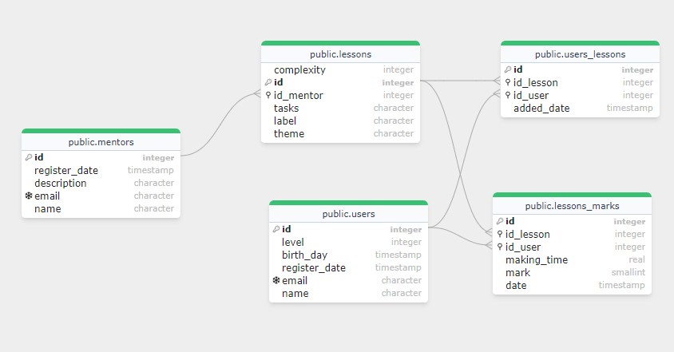

# Сайт для изучения

## _Учебный проект по летней практике 2024_

Выполнил Рогожин Дмитрий Александрович УВП-212

- Spring
- Hibernate
- ✨Magic ✨

## Бизнес запросы по заданию

1. Сформировать для пользователя перечень следующих уроков на основе пройденных и оценок за них (исходя из ошибок,
   времени выполенения и т.д.)

- http://localhost:8080/get_next_lessons/{userId}

2. Исходя из популярных на текущий момент уроков, подобрать тему для создания нового урока для создателя (количество
   прохождений урока за последние несколько недель)

- http://localhost:8080/get_popular_themes

3. Выдать статистику по оценкам за урок ранжировав её по уровню пользователей, длительности прохождения и дате

- http://localhost:8080/get_level_statistic/{lessonId}

## ER Диаграмма



## Бизнес запросы на SQL

Запрос 1

```SQL
SELECT theme
FROM lessons_marks
JOIN lessons ON lessons.id = id_lesson
WHERE id_user = {ид юзвера}
ORDER BY mark, making_time DESC
LIMIT 5;
```

```SQL
SELECT DISTINCT id_lesson
FROM lessons_marks
WHERE id_user = {ид юзвера};
```

```SQL
SELECT complexity, id, label, theme
FROM lessons
WHERE theme IN {темы найденые ранее}
AND id NOT IN {ид из прошлого запроса}
ORDER BY complexity
LIMIT 5;
```

Запрос 2

```SQL
SELECT id_lesson
FROM lessons_marks
WHERE date < {дата 1} AND date > {дата 2}
GROUP BY id_lesson
ORDER BY count(id) DESC
LIMIT 5;
```

```SQL
SELECT theme
FROM lessons
WHERE id IN {ид из прошлого запроса}
GROUP BY theme
ORDER BY count(theme) DESC;
```

Запрос 3

```SQL
SELECT level, making_time, mark, date
FROM lessons_marks
JOIN users ON users.id = id_user
WHERE id_lesson = {ид урока}
ORDER BY level DESC, making_time, date DESC;
```
